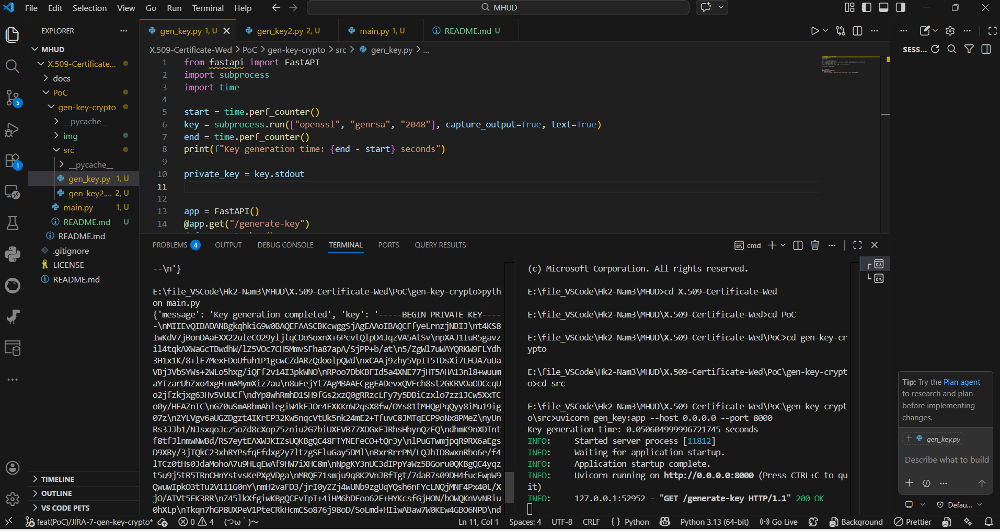
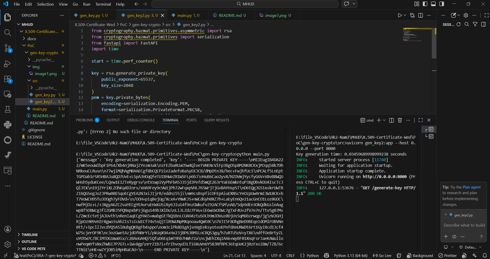

PoC: <gen-key-crypto>

## 1. Purpose:
Compare two approaches for RSA key generation:
* OpenSSL via subprocess
* Python cryptography library
Evaluate performance, integration complexity, and suitability for backend services.

---

## 2. Scope:
This PoC will do:
* Generate RSA key pairs using OpenSSL (CLI via subprocess)
* Generate RSA key pairs using Python cryptography library
* Expose HTTP APIs for both methods
* Measure execution time for each approach

---

## 3. Success Criteria
* Key generation works for both approaches
* Output format is PEM compatible
* Execution time is measured for both methods
* Differences in performance and integration are identified

---

## 4. Technology Used
* openssl
* Python cryptography library
* Library: subprocess, time 
* OS: window

---

## 5. Assumptions and Risks
Assumptions
* OpenSSL is installed and accessible via CLI
* Python cryptography library is installed and functional

Limitations of openssl
* Requires external process execution (higher overhead)
* Potential command injection risk if inputs are not sanitized
* Harder to integrate and handle errors in backend code
* Less flexible for programmatic use
* Platform-dependent (CLI behavior may vary across OS)

Limitations of cryptography
* Depends on OpenSSL backend
* Limited low-level configuration compared to OpenSSL CLI
* Less transparent error messages
* API complexity for beginners

---

## 6. evidence

---

## 7. Result & Evaluation

| Criteria             | OpenSSL (subprocess)               | cryptography                         |
|----------------------|------------------------------------|--------------------------------------|
| Performance          | ~50ms                              | ~35ms                                |
| Configuration control| limited (CLI defaults)             | high (explicit configuration)        |
| Integration          | Hard (CLI call)                    | Native Python                        |
| Security control     | Depends on CLI usage               | Better control in code               |
| Error handling       | Hard                               | Easier                               |

### Conclusion:
- cryptography is more suitable for backend integration due to:
  * Better performance
  * Easier error handling
  * No need for external process execution

- OpenSSL is useful for:
  * Compatibility with existing systems
  * Standardized CLI workflows

### Insight:
The performance difference is mainly due to subprocess overhead in OpenSSL CLI, while cryptography operates in-process, resulting in faster execution.